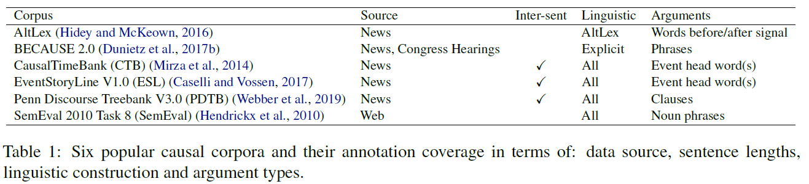
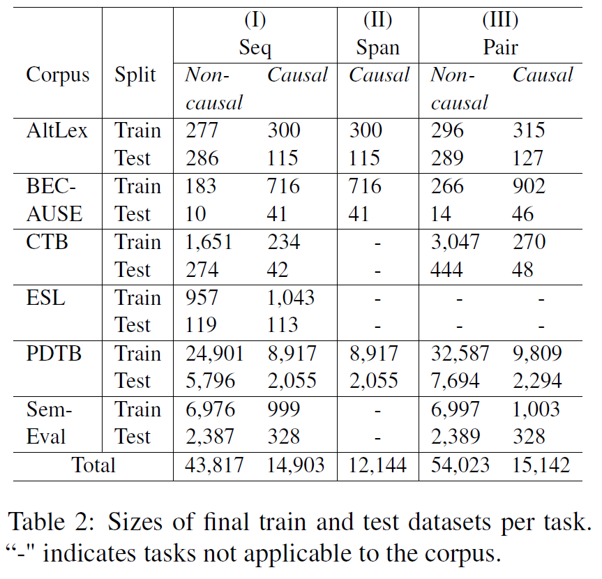
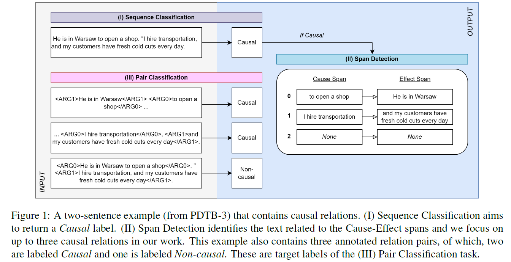
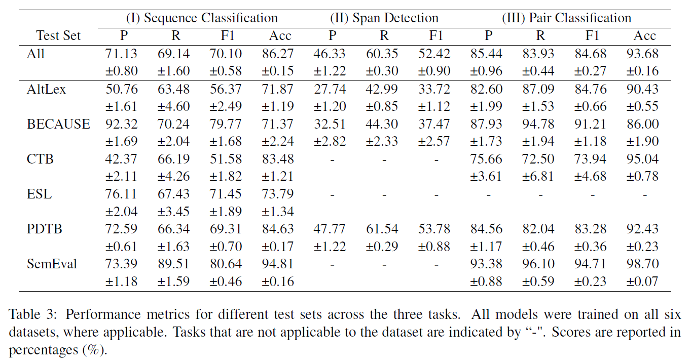
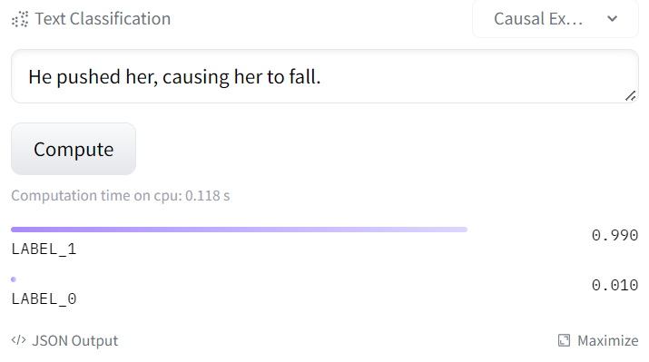
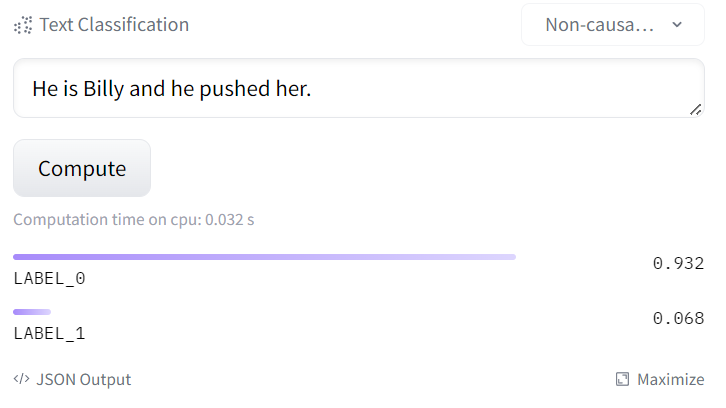

# UniCausal
Current causal text mining datasets vary in objectives, data coverage, and annotation schemes. These inconsistent efforts prevented modeling capabilities and fair comparisons of model performance. Few datasets include cause-effect span annotations, which are needed for end-to-end causal relation extraction. Therefore, we introduce [UniCausal, a unified benchmark and model for causal text mining](https://link.springer.com/chapter/10.1007/978-3-031-39831-5_23), based on six popular causal datasets and three common tasks. 

### Datasets included:
The six datasets reflect a variety of sentence lengths, linguistic constructions, argument types, and more. 



<br>



<br>

### Tasks covered:

(I) Sequence Classification <br>
(II) Cause-Effect Span Detection <br>
(III) Pair Classification <br>



<br>

For more details and analysis, please refer to our [corresponding paper titled "UniCausal: Unified benchmark and model for causal text mining"](https://arxiv.org/pdf/2208.09163.pdf).

<br>

# Code

### Set Up
Create virtual environment and download dependencies based on [`requirements.txt`](requirements.txt). If using `conda`, you may install the packages using [`extended_requirements.txt`](extended_requirements.txt).

<br>

### Dataset Loading
A key novelty of our framework is that once users download our repository, they can directly "call" the datasets to design Causal Text Mining models. 

We provide a tutorial to load datasets at [`tutorials/Loading_CTM_datasets.ipynb`](tutorials/Loading_CTM_datasets.ipynb). The main function to call is as follows:

```
from _datasets.unifiedcre import load_cre_dataset, available_datasets
print('List of available datasets:', available_datasets)

"""
 Example case of loading AltLex and BECAUSE dataset,
 without adding span texts to seq texts, span augmentation or user-provided datasets,
 and load both training and validation datasets.
"""
load_cre_dataset(dataset_name=['altlex','because'], do_train_val=True, data_dir='../data')
```
<br>

### Training & Testing

We adapted the Huggingface Sequence Classification and Token Classification scripts to create baselines per task. The codes are available as follows:

(I) [`run_seqbase.py`](run_seqbase.py): Sequence Classification <br>
(II) [`run_tokbase.py`](run_tokbase.py): Token Classification a.k.a. Cause-Effect Span Detection <br>
(III) [`run_pairbase.py`](run_pairbase.py): Pair Classification <br>




<br>

### Pretrained Models

We uploaded our `bert-base-cased` model adapted onto all datasets per task onto Huggingface Hub. Users who wish to plug and play can do so by calling the following pretrained model names directly:

(I) [`tanfiona/unicausal-seq-baseline`](https://huggingface.co/tanfiona/unicausal-seq-baseline): Sequence Classification <br>
(II) [`tanfiona/unicausal-tok-baseline`](https://huggingface.co/tanfiona/unicausal-tok-baseline): Token Classification a.k.a. Cause-Effect Span Detection <br>
(III) [`tanfiona/unicausal-pair-baseline`](https://huggingface.co/tanfiona/unicausal-pair-baseline): Pair Classification <br>

You may also play around with the Hosted Inference API on Huggingface Hub to directly try your own input sentences without any coding!

|      |
|:--:| 
| *Sequence Classification, where LABEL_1=Causal and LABEL_0=Non-causal, using Hosted Inference API on Hugginface. [Try it yourself!](https://huggingface.co/tanfiona/unicausal-seq-baseline?text=He+is+Billy+and+he+pushed+her.)* |

<br>

# Links to Original Datasets
1. [AltLex](https://github.com/chridey/altlex) (Hidey and McKweon, 2016)
2. [BECAUSE 2.0](https://github.com/duncanka/BECAUSE) (Duneitz et al., 2017)
3. [CausalTimeBank (CTB)](https://github.com/paramitamirza/Causal-TimeBank) (Mirza et al., 2014; Mirza and Tonelli, 2014)
4. [EventStoryLine V1.0 (ESL)](https://github.com/tommasoc80/EventStoryLine) (Caselli and Vossen, 2017)
5. [Penn Discourse Treebank V3.0 (PDTB)](https://catalog.ldc.upenn.edu/LDC2019T05) (Webber et al., 2019)
6. [SemEval 2010 Task 8 (SemEval)](https://semeval2.fbk.eu/semeval2.php?location=tasks&taskid=11) (Hendrickx et al., 2010)

<br>

# License & Usage

Our codes follow the [GNU GPL License](LICENSE). For the data, you must refer to individual datasets’ licenses. The following datasets had publicly available licenses:

- [BECAUSE 2.0: MIT License](https://github.com/duncanka/BECAUSE/blob/master/LICENSE)
- [EventStoryLine V1.0: CC License](https://github.com/tommasoc80/EventStoryLine/blob/master/LICENSE.md)
- [Penn Discourse Treebank V3.0: LDC User Agreement for Non-Members](https://catalog.ldc.upenn.edu/LDC2019T05)

Unfortunately, we were unable to find licensing information for AltLex, CausalTimeBank and SemEval 2010 Task 8. If you manage to find them, kindly inform us.


# Cite Us
If you used our repository or found it helpful in any way, please do cite us in your work:

```
@inproceedings{DBLP:conf/dawak/TanZN23,
  author       = {Fiona Anting Tan and
                  Xinyu Zuo and
                  See{-}Kiong Ng},
  editor       = {Robert Wrembel and
                  Johann Gamper and
                  Gabriele Kotsis and
                  A Min Tjoa and
                  Ismail Khalil},
  title        = {UniCausal: Unified Benchmark and Repository for Causal Text Mining},
  booktitle    = {Big Data Analytics and Knowledge Discovery - 25th International Conference,
                  DaWaK 2023, Penang, Malaysia, August 28-30, 2023, Proceedings},
  series       = {Lecture Notes in Computer Science},
  volume       = {14148},
  pages        = {248--262},
  publisher    = {Springer},
  year         = {2023},
  url          = {https://doi.org/10.1007/978-3-031-39831-5\_23},
  doi          = {10.1007/978-3-031-39831-5\_23},
  timestamp    = {Fri, 18 Aug 2023 08:45:01 +0200},
  biburl       = {https://dblp.org/rec/conf/dawak/TanZN23.bib},
  bibsource    = {dblp computer science bibliography, https://dblp.org}
}
```

If you have feedback or features/datasets you would like to contribute, please email us at tan.f[at]u.nus.edu.

<i>[Current version: 1.0.0]</i>
